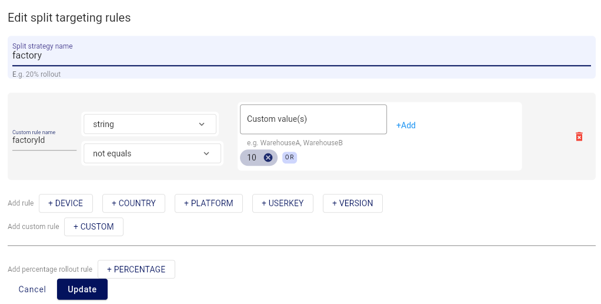
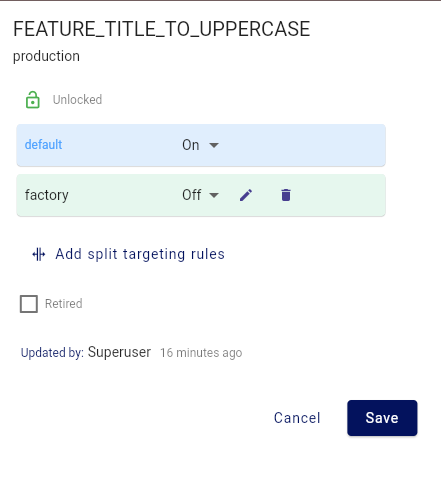

= featurehub-swift-sdk

NOTE: This SDK is in Beta

This is an App friendly FeatureHub SDK for Swift. It is designed
to allow for the use of Server Evaluated Keys, and focuses on
"use based evaluation" using the FeatureHub REST API. It is not intended for server side use.

== Quick Start

The basic use of the SDK is simple:

[source,swift]
----
let context = 
        EdgeFeatureHubConfig("https://featurehub-url", ["api-key"]).start()

----

This will give you a new `Context` that you can customise for the user or leave as is
and ask for features, e.g.

[source,swift]
----
if context.feature("UPPERCASE_TEXT").enabled {
    // do something
}
----

This context will live for five minutes (300 seconds, by default) before it attempts to reconnect to the FeatureHub
server to determine if there are new features.

=== Customising the Context

If you wish to customise the context, and use https://docs.featurehub.io/featurehub/latest/strategies.html#_rollout_strategies[FeatureHub Strategies], then
you can do so by setting those attribute values on the context and calling `build`. This triggers the SDK
to bundle up your configuration and send it to the FeatureHub server to get your customised feature
values given that set of attributes.

[source,swift]
----
await context.userKey("user@email.com").attribute("warehouseId", warehouseId).build()
----

There are several well known ids, such as userKey, session, country, platform, device and
version. You can also set any arbitrary single or multi-valued attribute for evaluation

==== A note on percentage based rollouts

A percentage based rollout is based on the session key or user key (in that order). For
a given session or user key, the chance a feature matches the percentage rollout is the same
across all platforms. If you configure a percentage rollout of 20% for instance, you must
set session or user to enable client to match against that percentage and stay consistent.
For example, if you indicated that 20% of your users had a new shopping category, then
used the userKey as their user-id, then the user would see the same experience across
all your delivery platforms, web, mobile, etc.

The userKey is combined with several other
things so being in the 20% for one feature may not mean 20% threshold on another feature.

=== Caching

The Swift SDK works by implicit caching. What this means if that you set a timeout for the cache (i.e. not 0), and
if you evaluate a feature past that timeout, the SDK will go and get an update to the cached set of features
in the background. Your code does not need to do anything other than set your desired timeout (or
go with the default 300 seconds), and keep evaluating features.

The SDK does not have a background automatic polling system as that is usually undesirable on Mobile.

The cache has a status - you can ask for it to determine if the cache is ready to be evaluated,
but you can always evaluate a feature, it will just return a "holder" and empty or false values.

[source,swift]
----
context.readiness == Readiness.ready
----

If you wish to set the timeout on the repository, you need to do it up front, with

[source,swift]
----
let context =
        EdgeFeatureHubConfig("https://featurehub-url", ["api-key"]).cacheTimeout(30).start()
----

for example - this would set it to 30 seconds. The FeatureHub server is able to override the cache
timeout at any time.

== Using the Example

The example is a simple to-do list.

Set up a feature in your FeatureHub instance called `FEATURE_TITLE_TO_UPPERCASE`, make
it a flag type, and unlock it, edit it and add a strategy called `factory`. Set the
custom field to `factoryId`, String, not-equals, and the value `10`.

Set the default value to ON and the targeted rule to OFF.

It makes the decision to set the cache timeout to
10 seconds, it uses a server evaluated key and then it creates a new context. It does
this in the global initializer because you cannot create a background task in the global
initializer and we decided to set some configuration in the context before we ask for
our first set of features.

[source,swift]
----
var context =
try! EdgeFeatureHubConfig("http://localhost:8085",
                     ["8c5d3253-4974-4455-a684-954ce6a6110d/EWddcsNnNza60FVIocq62ApdrzKlr9qxCfSlo323"])
    .cacheTimeout(10).newContext()
----

In the init section, we set the user key and a factoryId ("10"), and then ask the context
to "build" - which will cause the features to get grabbed and put in the repository for using.

[source,swift]
----
context.user("me@me.com").attribute("factoryId", "10")

Task.detached(operation: { // background this update
  await context.build()
})
----

Over in the view, we use the feature. Remember we can use it even if it isn't received yet,
the SDK will simply create a proxy for it and fill it in when it gets it.

[source,swift]
----
if context.feature("FEATURE_TITLE_TO_UPPERCASE").enabled {
    tasks.append(newTask.uppercased())
} else {
    tasks.append(newTask)
}
----

Add a task - because your `factoryId` is 10, it will use the default value which is On.
If you switch it to off and its been 10 seconds, add another task, this should also be
upper case, but immediately add another and it will be mixed case. You can try the
same scenario if you change your factoryId in your code to something other than 10.

== Future enhancements

- Ability to extract feature state and reload it so it can be cached ready for reload
- Modification of API to allow it to compile on Linux
- Addition of Streaming API for server support.
- Addition of support for client side keys
- Add support for interceptors

